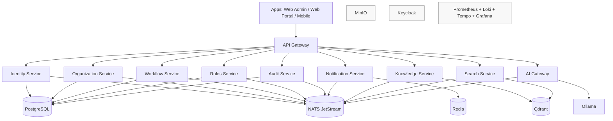

# Architecture

AI Enterprise OS uses a domain-oriented monorepo with clear separation between product applications, platform services, AI runtime, and infrastructure.

## Design decisions

- Service-per-domain boundaries to support independent scale and ownership.
- Shared package layers for cross-service consistency (logging, config, security, telemetry, event contracts).
- Docker Compose as local orchestration baseline for fast onboarding.
- Build and lint automation centralized via `Makefile`, pre-commit, and GitHub Actions.
