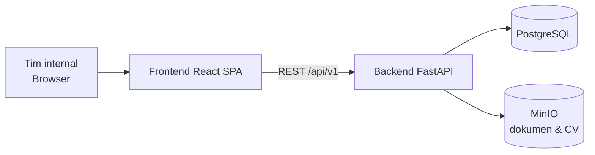

# Architecture

Aplikasi **modular monolith**: satu backend FastAPI dengan module per domain bisnis,
satu frontend React SPA, PostgreSQL untuk data, MinIO (S3-compatible) untuk dokumen.

```mermaid
flowchart LR
  U[Tim internal<br/>Browser] --> F[Frontend React SPA]
  F -->|REST /api/v1| B[Backend FastAPI]
  B --> P[(PostgreSQL)]
  B --> M[(MinIO<br/>dokumen & CV)]
```

## Backend

- **Modul domain** (`backend/app/modules/<domain>/`): setiap modul berisi
  `models.py` (SQLAlchemy), `schemas.py` (Pydantic), `service.py` (logika bisnis),
  `router.py` (endpoint). Modul MVP: `auth`, `presales`, `clients`, `recruitment`,
  `dashboard`.
- **Core** (`backend/app/core/`): konfigurasi (`config.py`), database session
  (`database.py`), keamanan JWT & password hashing (`security.py`), object storage
  client (`storage.py`), bootstrap admin (`bootstrap.py`).
- **Migrasi**: Alembic siap pakai; di mode dev tabel dibuat via `create_all`.

## Mengapa modular monolith

Sistem ERP-like dengan relasi antar domain yang kuat (placement → payrol → invoice)
lebih cepat dan aman dibangun dalam satu deployable. Batas modul dijaga disiplin
(modul hanya boleh mengimpor modul lain lewat `service.py`, bukan langsung ke model),
sehingga jika suatu saat perlu, modul dapat diekstrak menjadi service terpisah.

## Keputusan penting

| Keputusan | Alasan |
|-----------|--------|
| FastAPI sync + SQLAlchemy 2.0 | Ekosistem matang, cocok pola CRUD + laporan |
| JWT stateless + role enum | Cukup untuk tim internal < 50 user tanpa IAM eksternal |
| Dual-mode storage & database | Dev lokal: SQLite + folder `data/uploads` (zero-setup). Production: PostgreSQL + MinIO/S3 — cukup ganti env, kode sama |
| Docker Compose | Onboarding cepat; path ke Kubernetes tetap terbuka |

Rencana arsitektur fase lanjut (payrol, finance, akunting) mengikuti pola modul yang
sama — lihat [PRD §4](docs/02-product/PRD.md).
