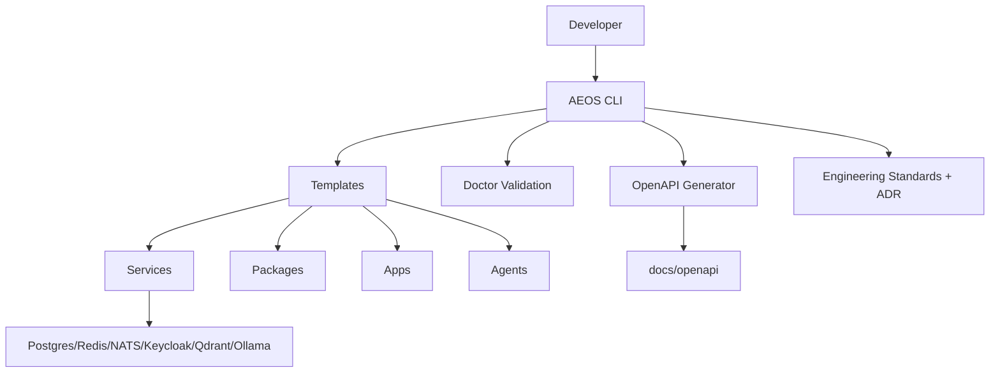

# Architecture Diagram

```mermaid
flowchart TD
  A[Developer] --> C[AEOS CLI]
  C --> T[Templates]
  C --> D[Doctor Validation]
  C --> O[OpenAPI Generator]
  T --> S[Services]
  T --> P[Packages]
  T --> APPS[Apps]
  T --> AG[Agents]
  S --> INFRA[Postgres/Redis/NATS/Keycloak/Qdrant/Ollama]
  O --> DOCS[docs/openapi]
  C --> STD[Engineering Standards + ADR]
```
