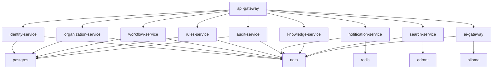
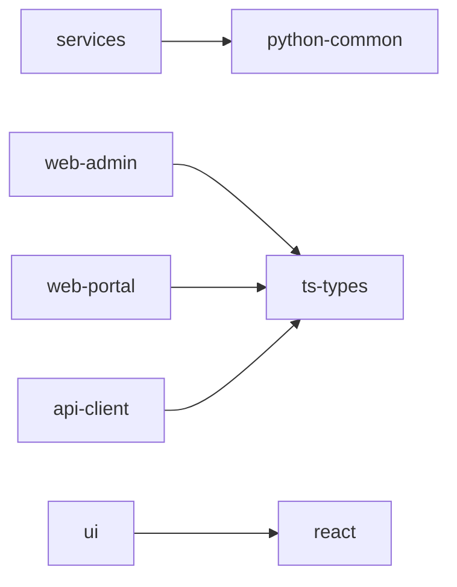

# Dependency Graph

## Service dependencies

```mermaid
graph TD
  api-gateway --> identity-service
  api-gateway --> organization-service
  api-gateway --> workflow-service
  api-gateway --> rules-service
  api-gateway --> audit-service
  api-gateway --> notification-service
  api-gateway --> knowledge-service
  api-gateway --> search-service
  api-gateway --> ai-gateway
  identity-service --> postgres
  organization-service --> postgres
  workflow-service --> postgres
  rules-service --> postgres
  audit-service --> postgres
  notification-service --> redis
  search-service --> qdrant
  ai-gateway --> ollama
  identity-service --> nats
  organization-service --> nats
  workflow-service --> nats
  rules-service --> nats
  audit-service --> nats
  notification-service --> nats
  knowledge-service --> nats
  search-service --> nats
  ai-gateway --> nats
```

## Package dependencies

```mermaid
graph LR
  services --> python-common
  web-admin --> ts-types
  web-portal --> ts-types
  api-client --> ts-types
  ui --> react
```
